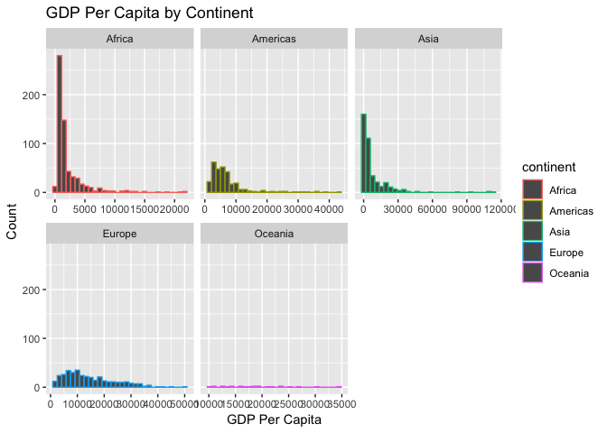
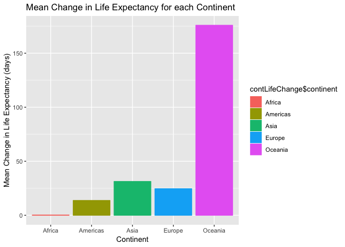

STAT545\_hmk3\_WilliamHall
================
William Hall
2018-19-02

> Tables added with File folder

In this homework assignment, I will be using dplyr/ggplot2 to manipulate and explore data. To start with I will call the 'tidyverse' and 'gapminder' packages using the library() function. To avoid startup messages, I have used the suppressPackageStartupMessages() function in the code below.

``` r
suppressPackageStartupMessages(library(tidyverse))
suppressPackageStartupMessages(library(gapminder))
```

Here are some of the functions we could use to do this:

-   `select()`
-   `filter()`
-   `arrange()`
-   `mutate()`
-   `summarize()`

`1. Get the maximum and minimum of GDP per capita for all continents.`
----------------------------------------------------------------------

To get these values we could use the max() and min() functions within the summarize() function, but first we must group by continents.

``` r
gapminder %>% 
  group_by(continent) %>% 
  summarize(maxGDP = max(gdpPercap),
            minGDP = min(gdpPercap))
```

    ## # A tibble: 5 x 3
    ##   continent  maxGDP minGDP
    ##   <fct>       <dbl>  <dbl>
    ## 1 Africa     21951.   241.
    ## 2 Americas   42952.  1202.
    ## 3 Asia      113523.   331 
    ## 4 Europe     49357.   974.
    ## 5 Oceania    34435. 10040.

`2. Look at the spread of GDP per capita within the continents.`
----------------------------------------------------------------

To examine this we could use ggplot and the facet\_wrap() function that will separate out all the histograms by continent.

``` r
ggplot(gapminder, aes(gdpPercap))+
  geom_histogram(aes(colour=continent)) +
  facet_wrap(~continent, scales = "free_x") +
  xlab("GDP Per Capita") + 
  ylab("Count") + 
  ggtitle("GDP Per Capita by Continent")
```

    ## `stat_bin()` using `bins = 30`. Pick better value with `binwidth`.



We could also examine this with a boxplot. We have scaled the y axis with scale\_y\_log10()

``` r
ggplot(gapminder, aes(continent,gdpPercap, fill = continent))+
  geom_boxplot() +
  geom_jitter(alpha = 0.2) +
  scale_y_log10() +
  xlab("Continent") + 
  ylab("GDP Per Capita") + 
  ggtitle("GDP Per Capita by Continent")
```


`3. Compute a trimmed mean of life expectancy for different years. Or a weighted mean, weighting by population. Just try something other than the plain vanilla mean.`
----------------------------------------------------------------------------------------------------------------------------------------------------------------------

Well let's dip our toe in the water first with a plain old vanilla mean. I'll toss in a median too just to spice things up.

``` r
gapminder %>% 
  summarize(meanLifeExp = mean(lifeExp),
            medLifeExp = median(lifeExp))
```

    ## # A tibble: 1 x 2
    ##   meanLifeExp medLifeExp
    ##         <dbl>      <dbl>
    ## 1        59.5       60.7

Ok, now let's isolate this down into life expectancy in the 1980's for Africa.

``` r
Africa1980 <- gapminder %>% 
  filter(year >= 1980 & year < 1990) %>% 
  filter(continent == "Africa")
  
  
mean(Africa1980$lifeExp)
```

    ## [1] 52.46883

`4. How is life expectancy changing over time on different continents?`
-----------------------------------------------------------------------

In order to determine how life expectancy is changing over time in different continents, we must first calculate how life expectancy is changing, then examine that change within each continent. Note that this is for the study period of the dataset which is between 1952 and 2007.

What we have done in the code below is calculate the change in life expectancy year over year for each country within each continent. Then we have summarized the mean change in life expectancy for each country in the continent. Then we have multiplied that by 365 to get the average change in life expectancy in days year over year for each continent.

``` r
contLifeChange <- gapminder %>% 
                      group_by(continent) %>% 
                      mutate(lifeExpChangePerYear = lifeExp -lag(lifeExp)) %>% 
                      filter(!is.na(lifeExpChangePerYear)) %>%
                      summarize(meanChangeinLifeExp = mean(lifeExpChangePerYear)) %>% 
                      mutate(meanChangeinDaysLifeExp = meanChangeinLifeExp *365)

contLifeChange
```

    ## # A tibble: 5 x 3
    ##   continent meanChangeinLifeExp meanChangeinDaysLifeExp
    ##   <fct>                   <dbl>                   <dbl>
    ## 1 Africa               0.000658                   0.240
    ## 2 Americas             0.0377                    13.7  
    ## 3 Asia                 0.0858                    31.3  
    ## 4 Europe               0.0674                    24.6  
    ## 5 Oceania              0.482                    176.

We could also plot this with geom\_histogram().

``` r
ggplot(contLifeChange, aes(contLifeChange$continent, fill = contLifeChange$continent)) +
  stat_summary(aes(y = contLifeChange$meanChangeinDaysLifeExp, colour = contLifeChange$continent), fun.y = "mean", geom = "bar") +
  scale_x_discrete("Continent") +
  scale_y_continuous("Mean Change in Life Expectancy (days)") +
  labs(title = "Mean Change in Life Expectancy for each Continent")
```



`5. Report the absolute and/or relative abundance of countries with low life expectancy over time by continent: Compute some measure of worldwide life expectancy – you decide – a mean or median or some other quantile or perhaps your current age. Then determine how many countries on each continent have a life expectancy less than this benchmark, for each year.`
--------------------------------------------------------------------------------------------------------------------------------------------------------------------------------------------------------------------------------------------------------------------------------------------------------------------------------------------------------------------------

So the first thing we need to do here is compute the mean worldwide Life Expectancy which is 59.4744394. Let's set our benchmark for high or low life expectancy at 59.4744394.

Now we need to create a variable that says whether the country is above=high or below=low life expectancy. Then we need to calculate what the percentage of countries in each continent are above and below that for each year. Unfortuantely, I couldn't find a way of doing this all in one data frame. Because we are creating the percentage of high vs. low, we need to create a new data frame and calculate this information in that dataframe.

The first step my code is to create the high vs. low for each contry in each year with an if else function.

Then I created a new dataframe using the previous data frame with three new variables. The first is a summary of all the countries with high life expectancy in

``` r
hlgap <- gapminder %>% 
             mutate(lifeExpCategorical = if_else(lifeExp > 59, "high", "low"))
  
hlgap1 <- hlgap %>% 
  group_by(continent, lifeExpCategorical) %>% 
  summarize(count = n()) %>% 
  mutate(TotalContCount = count+lead(count,default = NA),
          percentHigh = count/TotalContCount*100)
hlgap1
```

    ## # A tibble: 9 x 5
    ## # Groups:   continent [5]
    ##   continent lifeExpCategorical count TotalContCount percentHigh
    ##   <fct>     <chr>              <int>          <int>       <dbl>
    ## 1 Africa    high                  85            624        13.6
    ## 2 Africa    low                  539             NA        NA  
    ## 3 Americas  high                 222            300        74  
    ## 4 Americas  low                   78             NA        NA  
    ## 5 Asia      high                 229            396        57.8
    ## 6 Asia      low                  167             NA        NA  
    ## 7 Europe    high                 351            360        97.5
    ## 8 Europe    low                    9             NA        NA  
    ## 9 Oceania   high                  24             NA        NA

The TA actually showed me a much more eloquent way of approaching this which removes all the "NAs".

``` r
hlgap2 <- hlgap %>% 
  group_by(continent, lifeExpCategorical) %>% 
  summarize(count = n()) %>% 
  mutate(percentHigh = count/sum(count))
hlgap2
```

    ## # A tibble: 9 x 4
    ## # Groups:   continent [5]
    ##   continent lifeExpCategorical count percentHigh
    ##   <fct>     <chr>              <int>       <dbl>
    ## 1 Africa    high                  85       0.136
    ## 2 Africa    low                  539       0.864
    ## 3 Americas  high                 222       0.74 
    ## 4 Americas  low                   78       0.26 
    ## 5 Asia      high                 229       0.578
    ## 6 Asia      low                  167       0.422
    ## 7 Europe    high                 351       0.975
    ## 8 Europe    low                    9       0.025
    ## 9 Oceania   high                  24       1

Reflection
----------

This assignment was by far the most challenging I have done so far. I find it very difficult to use the group\_by() function. Something that the TA taught me is that sometimes you can't pipe everything, and you need to create a new data frame to be able to achieve what you are trying to do.

I think that some more complex examples in class would be very helpful.
